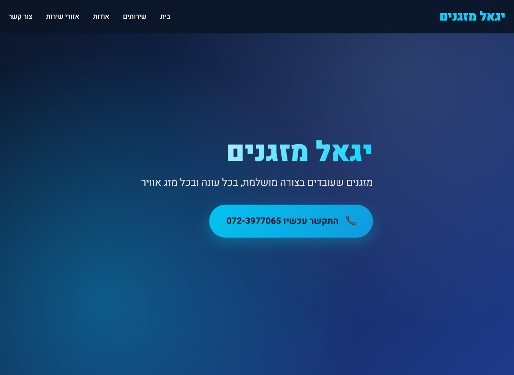
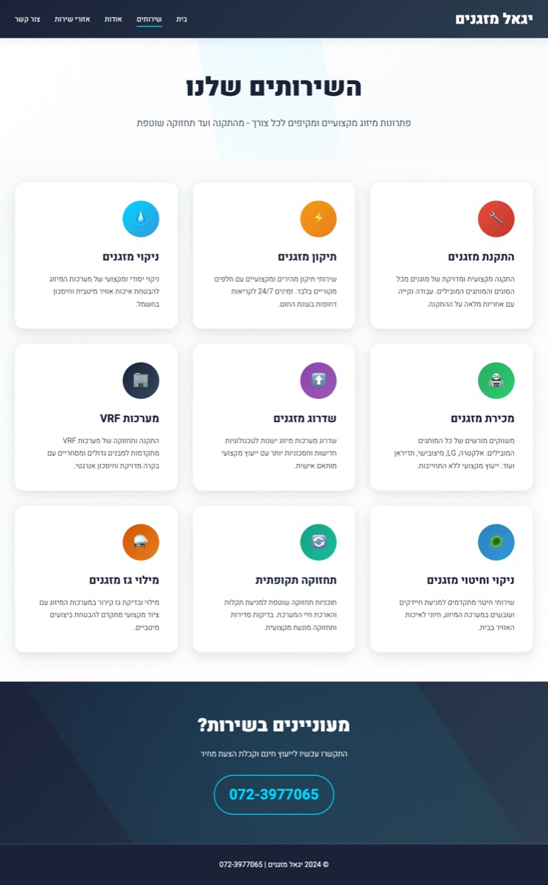
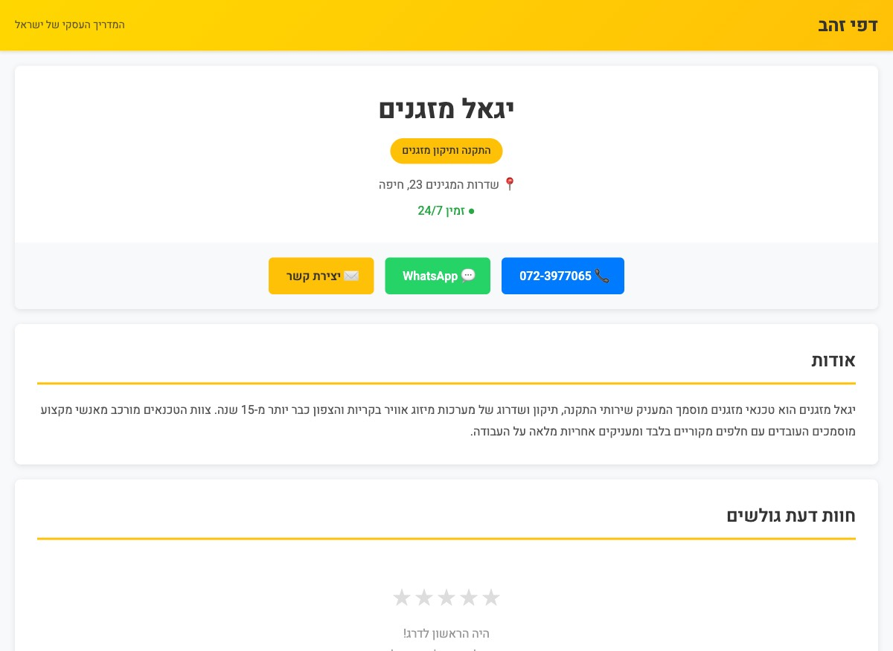

# Zap Onboarding AI

An AI-powered automation pipeline that onboards a new business client at Zap Group — from zero context to a complete onboarding package in under 3 minutes.

Built as a prototype for the **GenAI Exploration Lead** hiring challenge at Zap Group.

---

## The Problem

When a new client buys a Zap package (5-page website + Dapei Zahav minisite), a human account manager currently has to:
- Google the business manually
- Read through their existing website, directories, social pages
- Write up internal notes for themselves
- Prepare a welcome message to send the client
- Wait until they have enough info to start building

This takes time and is inconsistent across producers. This prototype replaces that manual work with a single automated pipeline.

---

## What It Does

One command triggers the full pipeline:

```bash
python main.py --name "יגאל מזגנים" --phone "072-3977065" --location "קריות"
```

Six steps run automatically, start to finish:

### Step 1 — Discover & Scrape
The pipeline takes the client's name, phone, and location (exactly what a CRM event would contain) and **searches the web to find their digital footprint**. It runs 4 targeted DuckDuckGo queries, collects candidate URLs, then **cross-verifies each one** — scraping it and confirming the phone number actually appears on the page before including it.

This prevents false positives. There are multiple "Yigal" AC technicians in Israel; the phone number is the unique identifier.

Verified URLs are then crawled in full — including all internal pages, satellite sites (WordPress, Weebly), and Israeli directory listings.

### Step 2 — Extract Client Card
All scraped text is fed into Claude with a structured extraction prompt. The model outputs a JSON object with:
- Business name, owner, phone, email, address, region
- Full services list and brand authorizations
- All service areas (cities)
- Customer testimonials
- Unique selling points
- **Notes for the producer** — digital presence gaps, observations, recommendations

A second call converts the JSON into a readable Hebrew summary (`client_card.md`) formatted for the Zap account manager to read before the onboarding call.

### Step 3 — Personalized Welcome Message
Claude generates a client-facing WhatsApp/email message, auto-sent the moment the purchase is logged. It references the client's specific services and brands (showing Zap already knows their business), includes links to the draft website and minisite, and asks them to confirm details.

### Step 4 — Draft 5-Page Website
Claude generates a complete 5-page HTML website — each page with its own layout spec and design direction. All content is populated from the extracted client data. No placeholder text.

### Step 5 — Draft Dapei Zahav Minisite
Claude generates a single-page HTML file styled to match the real `d.co.il` listing format — yellow/gold branding, contact buttons, about section, service details, hours, gallery placeholders, and contact form. This is what the client's new Dapei Zahav page will look like.

### Step 6 — CRM Log
Everything is written to a structured JSON entry representing what would be a real CRM record — unique ID, timestamps, all client data, action log, and pointers to every deliverable.

---

## Live Demo

The pipeline was run against a real client — **יגאל מזגנים**, an AC technician in the Krayot area with an existing website at `imazganim.co.il` but no Dapei Zahav presence. He represents a genuine new-client scenario.

| Deliverable | Live URL |
|---|---|
| Draft 5-page website | [yigal-mazganim.vercel.app](https://yigal-mazganim.vercel.app) |
| Draft Dapei Zahav minisite | [yigal-dapei-zahav.vercel.app](https://yigal-dapei-zahav.vercel.app) |

### Draft Website

[](https://yigal-mazganim.vercel.app)

[](https://yigal-mazganim.vercel.app/services.html)

### Draft Dapei Zahav Minisite

[](https://yigal-dapei-zahav.vercel.app)

---

## Sample Outputs

### Onboarding Welcome Message (auto-sent to client)

> שלום יגאל! 🌟
>
> ברוכים הבאים למשפחת זאפ דפי זהב!
>
> אנחנו שמחים לעבוד איתך ולקחת את יגאל מזגנים לשלב הבא - הכנו עבורך טיוטות ראשונות שכבר כוללות את כל השירותים שלך: התקנה, תיקון, ניקוי ומכירת מזגנים, כולל מערכות VRF ושירותים לכל המותגים הגדולים.
>
> 🔗 טיוטת האתר החדש: [yigal-mazganim.vercel.app](https://yigal-mazganim.vercel.app)
> 🔗 טיוטת מיני-האתר בדפי זהב: [yigal-dapei-zahav.vercel.app](https://yigal-dapei-zahav.vercel.app)
>
> בימים הקרובים נתאם איתך קריאת זום לעבור על החומרים, לתאים פרטים ולשמוע את המשוב שלך. נשמח אם תוכל לאשר:
> ✅ שעות הפעילות שלך
> ✅ פרטי הטלפון: 072-3977065
> ✅ האם פספסנו שירות כלשהו?
>
> אנחנו כאן בשבילך בכל שלב!
>
> בהצלחה,
> צוות זאפ דפי זהב

### CRM Log Entry (simulated)

```json
{
  "crm_id": "ZAP-20260408131050",
  "created_at": "2026-04-08T13:10:50",
  "status": "onboarding_initiated",
  "client_data": {
    "business_name": "יגאל מזגנים",
    "phone": "072-3977065",
    "city": "חיפה",
    "region": "צפון",
    "services": ["התקנת מזגנים", "תיקון מזגנים", "ניקוי מזגנים", "מכירת מזגנים", "מערכות VRF", "..."],
    "brands": ["אלקטרה", "תדיראן", "LG", "מיצובישי", "סמסונג", "..."],
    "years_experience": "יותר מ-15 שנה"
  },
  "actions_taken": [
    { "action": "digital_assets_scanned",    "timestamp": "2026-04-08T13:10:50" },
    { "action": "client_card_generated",     "timestamp": "2026-04-08T13:10:50" },
    { "action": "welcome_message_sent",      "timestamp": "2026-04-08T13:10:50", "channel": "email" },
    { "action": "draft_website_generated",   "timestamp": "2026-04-08T13:10:50" },
    { "action": "draft_minisite_generated",  "timestamp": "2026-04-08T13:10:50" }
  ],
  "deliverables": {
    "client_card": "client_card.json",
    "client_card_readable": "client_card.md",
    "welcome_message": "welcome_message.md",
    "draft_website": "website/",
    "draft_minisite": "minisite/index.html"
  }
}
```

In production, this JSON payload would be a POST to Salesforce/HubSpot/Pipedrive — logging the full onboarding event under the client's record with all actions and deliverables attached.

---

## Output Files

Every pipeline run produces:

```
output/
├── client_card.json        — structured client data (machine-readable)
├── client_card.md          — Hebrew summary for the Zap producer
├── welcome_message.md      — personalized client-facing message
├── crm_log.json            — simulated CRM entry with full action log
├── website/
│   ├── index.html          — homepage
│   ├── services.html       — services page
│   ├── about.html          — about / brand story
│   ├── areas.html          — service areas
│   └── contact.html        — contact page
└── minisite/
    └── index.html          — Dapei Zahav listing
```

---

## Running It

### Setup

```bash
git clone https://github.com/shaiaviv/zap-onboarding-ai.git
cd zap-onboarding-ai
python -m venv venv && source venv/bin/activate
pip install -r requirements.txt
echo "ANTHROPIC_API_KEY=your_key_here" > .env
```

### Run — Discovery mode (real CRM trigger simulation)

```bash
python main.py --name "שם העסק" --phone "05X-XXXXXXX" --location "עיר"
```

Searches the web for the client's digital footprint, verifies each result, then runs the full pipeline.

### Run — Direct URL mode

```bash
python main.py --url https://www.example.co.il/
```

Skips discovery, scrapes the given URL and all its internal pages directly.

---

## Tech Stack

| Layer | Tool |
|---|---|
| Scraping | `requests` + `BeautifulSoup4` |
| Discovery | `ddgs` (DuckDuckGo Search) |
| AI / LLM | Anthropic Claude (`claude-sonnet-4-20250514`) |
| Output | Static HTML + JSON + Markdown |
| Hosting (demo) | Vercel |

No browser automation — all target sites are static HTML, so `requests` is faster and cheaper than Playwright.

---

## Design Decisions

**Why requests over Playwright?**
During research, Playwright-based scraping cost ~61 tool calls for a single site (browser render → snapshot → parse cycle). `requests.get()` + BeautifulSoup does the same in one call. For static sites, there's no reason to spin up a browser.

**Why phone-number cross-verification?**
Common business names like "יגאל מזגנים" return multiple unrelated businesses in search results. The phone number is the unique identifier that ties a web presence back to the specific client in the CRM.

**Why embed design principles into the LLM prompt?**
The first generated website was generic. Rather than post-processing the HTML, we embedded explicit typography, color, and layout guidance directly into the system prompt — the model produces better output when given a clear aesthetic direction rather than being left to its own defaults.

**What's simulated vs. what's real?**
- The scraping, extraction, and generation are all real — running against a real client's live website
- The CRM write is simulated (JSON file instead of an API call)
- The message sending is simulated (file instead of email/WhatsApp API call)
- In production, both would be replaced with API calls to whatever systems Zap uses
